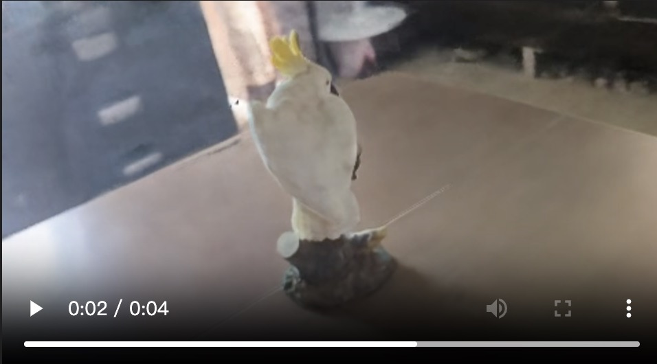

# DATA620004_task3

## 基于NeRF的物体重建和新视图合成
基本要求：

（1） 选取身边的物体拍摄多角度图片/视频，并使用COLMAP估计相机参数，随后使用现成的框架进行训练；

（2） 基于训练好的NeRF渲染环绕物体的视频，并在预留的测试图片上评价定量结果。


## Requirements

请使用如下命令安装所需的python环境：
```bash
pip install tensorboard
pip install -r requirements.txt
```


已训练的模型文件通过下面的链接下载：

链接: https://pan.baidu.com/s/1U4G4-8P7qfwgF9L1al7T_g?pwd=usf7 提取码: usf7 

解压下载的文件，得到`./logs`文件夹，放入仓库中即可正常运行代码。

其中还包括我们已经完成的重建视频，您可以直接观看。

## How to Run


#### 数据说明

要完成重建任务，首先需要环绕目标物体进行视频录制，然后从视频中抽取一定帧数的图像用于模型训练。

获取一系列的环绕图像(.jpg)后，您应该利用COLMAP工具将jpg图像转化成可用于训练的标准位姿数据格式。

`data/nerf_llff_data`中是我们已经用COLMAP转化好的鹦鹉饰品数据集，您可以直接使用它来完成训练。




#### 运行训练

使用如下命令即可运行训练代码：
```bash
python run_nerf.py --config configs/lzf_config.txt --spherify --no_ndc
```


#### 部署推理
使用如下命令即可运行推理/测试代码：
```
python run_nerf.py --config configs/lzf_config.txt --render_only
```


#### tensorboard可视化
使用如下命令即可查看tensorboard记录：
```
tensorboard --log_dir=./tensor_log
```


